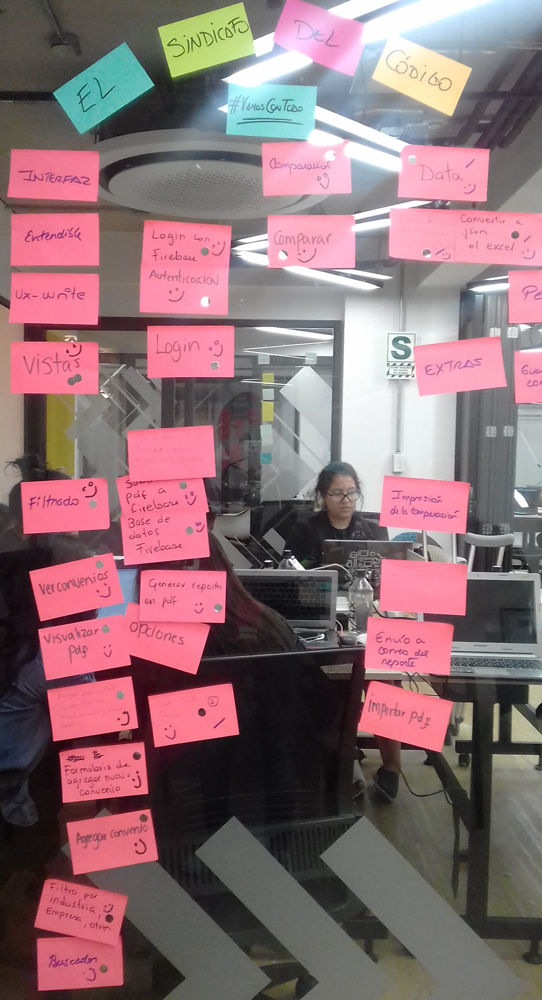

# MIRANDA & AMADO:

El siguiente proyecto es una plataforma web responsive que brinda al usuario información sobre los convenios colectivos realizados por la firma de abogados Miranda & Amado. Permite comparar, filtrar, buscar y añadir los convenios de acuerdo a palabras clave. Además si se desea, puede descargarse el documento en formato pdf.

# Equipo de trabajo: 

- Jennifer Milagros Carmen (Front End Developer)
- Luz Marina Rodriguez (Front End Developer)
- Aracely Gutarra (Front End Developer)
- Carla Centeno (Front End Developer)
- Cisneros Torre, Yelitza (Ux-Designer)

#Descripción del Reto:

El reto consistió en desarrollar una solución digital accesible desde la PC y el móvil. En la cual un usuario acreditado con una contraseña, pueda obtener los datos relevantes de las convenios colectivos realizados por la firma de abogados y los sindicatos.

# Objetivo:

Desarrollar una plataforma amigable para el usuario, implementando la información del excel de manera efectiva y práctica. Representar a través de la plataforma el branding y los valores de la empresa.

# Desarrollo:

Para la resolución del reto seguimos las etapas de DCU (Diseño Centrado en el Usuario) y las herramientas de Design Thinking. 

### Etapa DCU (Diseño Centrado en el usuario):

### A. Descubrimiento:

**Actividades**

**1.- Entrevista al cliente**

Se realizó una reunión con Felipe Gamboa (Abogado Laboralista), Alvaro y José Antonio Palomino (Jefe del área TI). Obtuvimos los requerimientos y necesidades y dificultades que atraviesa con la plataforma actual que utilizan. 

**2. Design Law**

Para tener una mejor información del tema, se investigó sobre la integración de la tecnología en el ámbito legal, especialmente en el desarrollo de interfaces para usuarios secundarios, pero también interesados en el ámbito legal.

En el artículo, [Writing privacy notices people will actually read: A GDPR legal design challenge](https://medium.com/juro-blog/writing-privacy-notices-people-will-actually-read-a-gdpr-legal-design-challenge-1f2000805740) de 
Richard Mabey, afirma que los principios del diseño legal nos guian a iniciar desde las necesidades de los usuarios finales. también comenta la complejidad de realizr documentos legales.
Así también sugiere la importancia de ser creativo al momento de mostrar la información. Hacet los documentos entendibles para cualquier persona interesada en leerlos. 

En el artículo, [The State of Legal Design: the big takeaways of the Stanford Law + Design Summit](https://medium.com/legal-design-and-innovation/the-state-of-legal-design-the-big-takeaways-of-the-stanford-law-design-summit-ee363b5bf109) de Margaret Hagan, abarca un punto importante al señalar la necesidad de testear a diferentes partes de la comunidad legal, para generar estrategias efectivas. Con un enfoque especial en los *no-abogados*, cómo podemos llegar a ellos y cómo podemos entenderlos mejor.

### B. Síntesis y definición

**Actividades**

**1.- Definición del problema: Diagrama de afinidad y Lluvia de ideas**

Para tener un mejor enfoque de las ideas realizamos un diagrama de afinidad que involucraran las soluciones y tareas a realizar durante el proyecto. Los items fueron:

- Interfaz.
- Registro.
- Comparación de datos.
- Data.

**2.- Priorización de los items encontrados**

Se decidió dar priorización a los siguientes requerimientos:

- Inició de sesión.
- Filtrado y búsqueda de los documentos.
- Ordernar los documentos de acuerdo al más reciente.
- Selección, comparación y reporte de detalles de los convenios elegidos.
- Mostrar el pdf original del documento.
- Accesibilidad para desktop y mobile.

### C. Prototipado

**Actividades**

**1. Paper prototype**

[Paper Prototype](https://docs.google.com/presentation/d/1KNK-XX1gHy8r9OUGD6TgWCn59hTx1rK-qXS14kntQN0/edit?usp=sharing)

**Testing con el cliente**

- Cambio del diseño del reporte de comparación.
- Nuevo requerimiento de visualización del pdf.
- Agregar un botón de vista de detalles.
- Botón directo para ver el pdf.

### D. Iteración y Síntesis:

Luego de una nueva deliberación en el equipo y corrección de errores, se decidió replantear el diseño de las vistas de comparación, por su dificultad para la visualización en mobile. 

**Actividades**

**1.- User flow del prototipo**

[User flow](https://docs.google.com/presentation/d/1QAvqmcUD1D995y0dSZOB7MC0iBu4jZoU1t-EpNzzRns/edit?usp=sharing)

### E. Herramientas utilizadas:

- HTML5
- CSS3
- Bootstrap 4.
- Firebase
- Javascript.
- LocalStorage.
